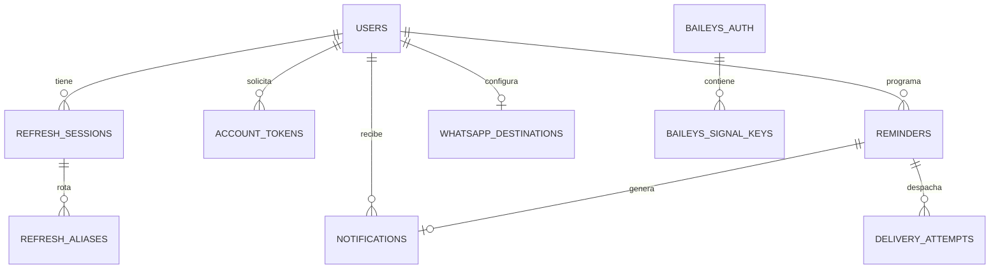

# Esquema de PostgreSQL implementado

Este documento refleja las migraciones Alembic de `main`, desde
`0001_whatsapp` hasta `0006_reminder_soft_delete`. La base se aloja en Neon;
su URL de conexión contiene credenciales y no se publica. La lectura del
esquema en código no sustituye la comprobación de `alembic_version` en la
base desplegada. El [diagrama del MVP](specs/MVP_RECORDATORIOS.md)
incluye componentes previstos, como Web Push, que todavía no tienen tablas.

| Tabla | Clave y relaciones | Función y restricciones principales |
|---|---|---|
| `users` | `id` PK | Cuenta; `email_normalized` es único y la contraseña se guarda como hash. |
| `refresh_sessions` | `id` PK; `user_id → users.id` | Sesiones renovables con hash de token, generación, expiración y revocación. |
| `refresh_aliases` | `token_hash` PK; `session_id → refresh_sessions.id` | Ventana breve para renovaciones concurrentes. |
| `auth_rate_limits` | `key` PK | Contadores por ventana para limitar solicitudes de autenticación. |
| `account_tokens` | `id` PK; `user_id → users.id` | Hashes de enlaces de verificación o recuperación, con expiración y consumo único. |
| `reminders` | `id` PK; `user_id → users.id` | Mensaje, fecha UTC, zona IANA, estado y versión. `(user_id, idempotency_key)` es único; `deleted_at` marca eliminación lógica. |
| `notifications` | `id` PK; `user_id → users.id`; `reminder_id → reminders.id` | Aviso interno; `reminder_id` es único. |
| `whatsapp_destinations` | `id` PK; `user_id → users.id` | Un destino por cuenta. Número cifrado, hash y versión de consentimiento; el hash del número activo es único. |
| `delivery_attempts` | `id` PK; `reminder_id → reminders.id` | Estado e intentos de envío. `(reminder_id, channel, destination_key)` es único. |
| `whatsapp_dispatch_windows` | `key` PK | Contador global de envíos por ventana. |
| `baileys_auth` | `session_id` PK | Credenciales cifradas de la sesión emisora. |
| `baileys_signal_keys` | `id` PK; `session_id → baileys_auth.session_id` | Claves Signal cifradas; `(session_id, key_type, key_id)` es único. |
| `whatsapp_send_requests` | `request_key` PK | Registro idempotente de solicitudes al emisor y su resultado. |

No existen todavía tablas de notas ni de suscripciones Web Push. Para una
instalación nueva se aplica `alembic upgrade head` con la credencial de
migración; el head del código documentado es `0006_reminder_soft_delete`.
