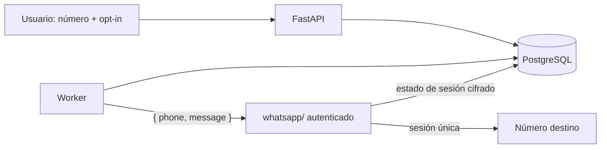

# ADR-0001: Emisor central de WhatsApp y números destino por usuario

- Estado: aceptado
- Fecha: 7 de octubre de 2026
- Responsables: equipo del proyecto

## Contexto

El MVP permite enviar por WhatsApp una copia opcional de un recordatorio. El
producto necesita distinguir dos conceptos:

- la cuenta o sesión que envía los mensajes;
- el número de cada usuario que recibe sus recordatorios.

No se desea que cada usuario conecte su propia cuenta de WhatsApp. El equipo
conectará y operará un único emisor, y la aplicación sólo consumirá un endpoint
para enviar un mensaje al número registrado por el usuario.

El repositorio ya prevé un servicio whatsapp/ en TypeScript/Node.js con
Baileys. Baileys no es una integración oficial de WhatsApp y necesita una sesión
persistente, por lo que debe mantenerse aislado y sustituible.

## Decisión

Se implementará un único servicio emisor whatsapp/, conectado y administrado
por el equipo.

1. El usuario registra como máximo un número destino activo y un opt-in; un
   número activo sólo puede pertenecer a una cuenta a la vez. No conecta una
   cuenta de WhatsApp.
2. FastAPI conserva el número cifrado, una huella para controles de unicidad y
   una versión enmascarada para la interfaz.
3. El worker determina cuándo corresponde enviar un recordatorio.
4. El worker usa el adaptador del backend Python para consumir el endpoint
   autenticado de whatsapp/ con, como mínimo, { phone, message }.
5. whatsapp/ usa la única sesión Baileys para enviar al destino solicitado.
6. PostgreSQL conserva el ledger y la fuente de verdad; whatsapp/ no decide
   permisos, programación ni ownership.
7. whatsapp/ persiste las credenciales y las claves Signal de la sesión en
   tablas propias de PostgreSQL en Neon. Los valores se cifran antes de
   guardarse; la clave de cifrado queda como secreto de Render. En ejecución,
   sólo whatsapp/ puede acceder a esas tablas.



## Contrato mínimo

El contrato completo de esta versión está en
[WHATSAPP_V1.md](../contracts/WHATSAPP_V1.md).

Render proporciona la URL base HTTPS pública al desplegar whatsapp/. El worker
la recibe mediante WHATSAPP_API_URL; whatsapp/ implementa la ruta versionada
/v1/messages. La URL real no se fija en el repositorio. Como el servicio Free
no recibe tráfico privado, la llamada usa HTTPS y autenticación entre servicios.

```http
POST /v1/messages
Authorization: Bearer <service-token>
Idempotency-Key: <uuid>
Content-Type: application/json
```

```json
{
  "phone": "+525512345678",
  "message": "Recordatorio: pagar la tarjeta"
}
```

El contrato versionado precisa autenticación, validación, límites, errores,
estados e idempotencia. El consumidor aplica un timeout explícito.

Una respuesta exitosa significa “aceptado por el servicio”. No significa
“entregado” o “leído” salvo que exista evidencia adicional.

## Alternativas consideradas

### Una conexión por usuario

Rechazada. Multiplica sesiones, credenciales, fallos y soporte; contradice el
flujo definido, donde el usuario sólo proporciona un número destino.

### Integración directa desde el navegador

Rechazada. Expondría credenciales y permitiría saltarse autorización, rate limits
y ledger de entregas.

### Integración de WhatsApp dentro de FastAPI

Rechazada mientras se use Baileys. Mezclaría runtimes y acoplaría dominio,
sesión y transporte. El servicio aislado permite sustituir Baileys sin cambiar
las reglas de recordatorios.

### Proveedor oficial administrado

No se elige para esta prueba, pero sigue siendo la ruta de sustitución preferida
si el producto pasa a producción real o las condiciones de uso lo requieren.
El adaptador evita que ese cambio alcance al dominio.

## Consecuencias positivas

- experiencia simple para el usuario;
- una sola sesión que operar y proteger;
- FastAPI conserva permisos y fuente de verdad;
- contrato pequeño y comprobable;
- Baileys queda aislado y sustituible;
- el canal puede desactivarse sin afectar las notificaciones internas.

## Consecuencias y riesgos

- el emisor central es un punto único de fallo;
- la sesión necesita almacenamiento durable en Neon fuera del filesystem efímero;
- el worker y whatsapp/ deben permanecer activos para entregar puntualmente;
- Baileys no es oficial y puede sufrir cambios o restricciones;
- capturar formato y opt-in no demuestra propiedad del número;
- un timeout sin idempotencia puede dejar resultado unknown;
- una sola sesión limita throughput y exige rate limiting;
- un uso abusivo puede afectar a todos los usuarios.

## Controles

- red privada o autenticación fuerte entre servicios;
- TLS, timeout y límites de payload;
- secretos sólo en los entornos que los usan;
- número cifrado, enmascarado y ausente de logs;
- consentimiento versionado y posibilidad de opt-out;
- ledger con constraint único por recordatorio, canal y destino;
- no reintentar a ciegas resultados ambiguos;
- límites por usuario y globales;
- health checks, heartbeat y alertas;
- ninguna prueba ordinaria usa destinatarios reales;
- revisión de condiciones de uso antes de producción.

## Fuera de alcance

- conectar cuentas personales de los usuarios;
- múltiples emisores;
- múltiples números por usuario;
- campañas, broadcasts o marketing;
- chatbot bidireccional;
- prometer entrega o lectura sin evidencia;
- vincular una sesión real sin aprobación humana explícita.

## Validación requerida

- pruebas contractuales de { phone, message } en ambos servicios;
- éxito, 4xx, 429, 5xx, timeout y resultado ambiguo;
- cambio y desactivación del número;
- credenciales ausentes o inválidas;
- dos workers intentando el mismo recordatorio;
- caída después de aceptar la solicitud;
- prueba de que un fallo no elimina la notificación interna.

## Rollback

Desactivar el canal mediante configuración o feature flag, detener nuevos jobs de
WhatsApp y conservar las notificaciones internas. No borrar el ledger durante
el rollback. La sesión emisora puede revocarse después de detener el tráfico y
con aprobación explícita.
