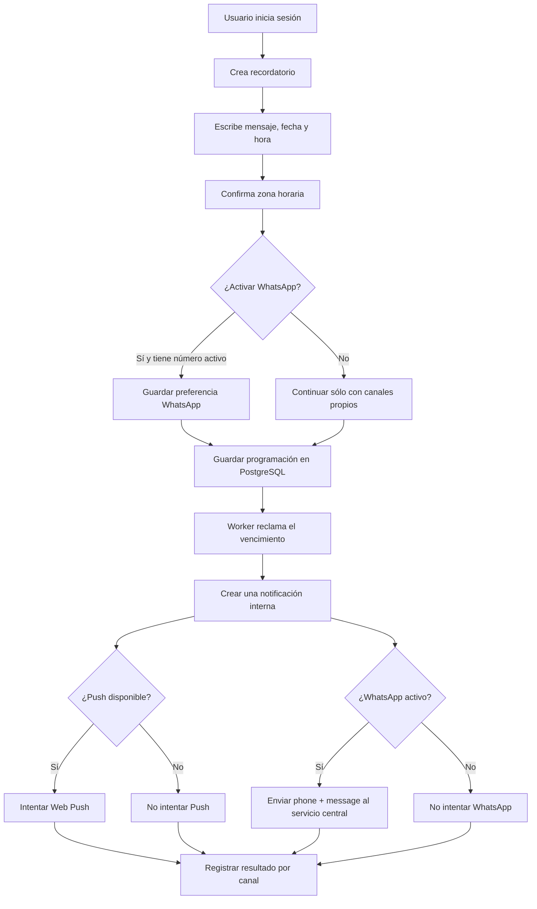
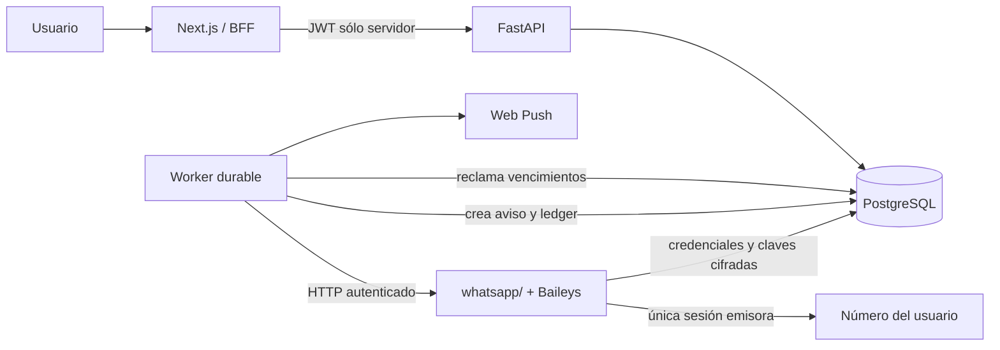
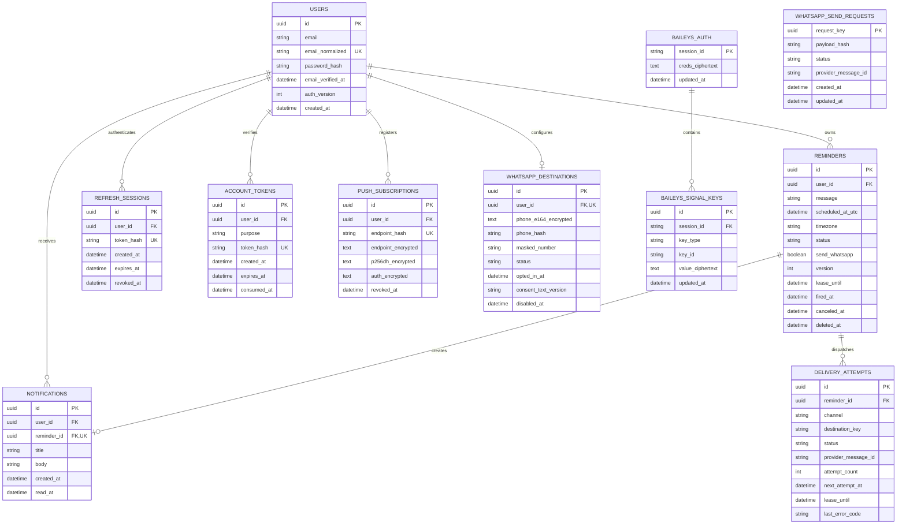

# MVP — Recordatorios multicanal

- Estado: diseño objetivo; implementación parcial
- Fecha: 7 de octubre de 2026
- Alcance: prueba técnica
- IA en producción: no
- App desplegada: [iniciar sesión](https://recordatorios-web-one.vercel.app/login)

El estado verificable del corte entregado está en
[Estado de la entrega](../ESTADO_ENTREGA.md). Las secciones de Web Push, PWA y
suscripciones describen el objetivo de producto, no funciones disponibles en
`main`. El PDF no exige notas como entidad separada: el texto de cada
recordatorio puede usarse como nota programada, pero no se guarda sin aviso.

## 1. Definición del producto

La aplicación permite programar recordatorios personales. Cuando llega la hora,
siempre crea una notificación dentro de la app. Además puede mostrar una Web
Push, si el usuario dio permiso, y enviar una copia por WhatsApp, si el usuario
registró un número y activó ese canal.

El corte implementado guarda notas breves como texto de recordatorios, siempre
con fecha y hora. El PDF pide notas y recordatorios, sin definir si deben ser
entidades distintas; la app no ofrece notas libres sin programación.
El valor de este corte consiste en entregar un aviso a la hora correcta,
conservarlo en una bandeja propia y mostrar qué ocurrió en cada canal.

### Jerarquía de canales

| Canal | Función | Condición |
|---|---|---|
| Notificación interna | Aviso canónico y persistente | Siempre |
| Web Push | Aviso fuera de la pantalla abierta | Permiso y suscripción activos |
| WhatsApp | Copia adicional del mismo recordatorio | Número activo, opt-in y preferencia del recordatorio |

Un fallo externo nunca borra ni invalida la notificación interna.

## 2. Decisión sobre WhatsApp

Existe un único emisor de WhatsApp conectado y administrado por el equipo en el
servicio whatsapp/. Los usuarios no conectan cuentas personales, no escanean
un QR y no proporcionan tokens o sesiones.

Cada usuario sólo puede:

1. registrar un número destino;
2. aceptar recibir recordatorios por ese medio;
3. activar o desactivar WhatsApp para cada recordatorio;
4. cambiar o eliminar su número.

En el corte actual, otra persona puede crear su propia cuenta de la app y
registrar un destino distinto. Esto no vincula una sesión personal de
WhatsApp: todos los mensajes siguen saliendo del emisor central. Un destino
activo no puede repetirse entre cuentas; cambiarlo reemplaza el anterior.
La [guía de uso y sus límites](../../README.md#número-de-cada-cuenta-de-la-app)
explica el flujo implementado.

Un número destino activo sólo puede estar asignado a una cuenta a la vez.
Al desactivarlo, deja de reservarse para esa cuenta.

Cada vencimiento produce una solicitud individual. No se hacen broadcasts ni
campañas:

```text
worker
  → POST al servicio whatsapp/
    → { phone, message }
      → una sesión emisora de Baileys
        → número destino del usuario
```

La decisión completa y sus consecuencias están en
[ADR-0001-whatsapp-centralizado.md](../adr/ADR-0001-whatsapp-centralizado.md).

## 3. Usuario objetivo

Personas que quieren recordar citas, pagos o tareas puntuales y desean contar
con una bandeja propia, sin depender exclusivamente de WhatsApp.

## 4. Problema

Una nota no avisa por sí sola y un canal externo puede fallar, estar desconectado
o no haber sido configurado. La aplicación necesita:

- programar el aviso de forma durable;
- conservar una notificación interna;
- ofrecer canales adicionales sin convertirlos en requisito;
- evitar duplicados ante reinicios o reintentos;
- explicar el resultado sin prometer estados que no puede comprobar.

## 5. Flujo principal objetivo



## 6. Experiencia de usuario

### 6.1 Cuenta y acceso

El usuario crea una cuenta con correo y contraseña y puede usarla de inmediato.
La API envía mediante Resend un enlace de verificación después de confirmar la
creación de la cuenta, sin mantener abierta una transacción durante la llamada
de red. La cuenta conserva el estado pendiente hasta que el usuario confirme
el correo. Si el envío falla, puede solicitar un
nuevo enlace sin crear otra cuenta. Si olvida la contraseña, solicita un enlace
de recuperación al correo registrado y establece una nueva contraseña desde
ese enlace. La respuesta a la solicitud es la misma exista o no la cuenta.

El correo de recuperación demuestra posesión de la dirección en ese momento.
Al usarlo, el enlace queda consumido, el correo queda verificado y se revocan
las sesiones anteriores. Resend sólo transporta los mensajes: FastAPI genera,
valida y consume los tokens. La API key nunca llega al navegador.

### 6.2 Primer acceso objetivo

El primer acceso no se bloquea con permisos ni integraciones:

```text
Todavía no tienes recordatorios.

[ Crear mi primer recordatorio ]

Opcional:
[ Activar notificaciones de este dispositivo ]
[ Agregar mi número de WhatsApp ]
```

El permiso de Web Push sólo se solicitaría después de que el usuario pulse una
acción que explique su beneficio. Esa acción aún no existe en la web actual.

### 6.3 Crear recordatorio

Campos mínimos:

- mensaje, requerido, máximo 280 caracteres;
- fecha;
- hora;
- zona horaria IANA detectada, visible y editable;
- interruptor “También por WhatsApp”, disponible cuando existe un número activo.

Si la hora local elegida no existe por un cambio de horario, se ajusta al
primer instante válido posterior. Si ocurre dos veces, se usa la segunda
ocurrencia, que corresponde al instante UTC más tardío. El resumen muestra la
fecha y hora efectivas antes de guardar; la validación de fecha futura se aplica
después del ajuste.

Resumen antes de guardar:

```text
Te avisaremos el 18 de octubre a las 09:00
America/Mexico_City

✓ Dentro de la app
✓ Notificación de este dispositivo, si está activada
✓ WhatsApp: •••• 5678
```

Los canales opcionales nunca impiden guardar.

### 6.4 Dashboard

- próximos recordatorios en orden cronológico;
- recordatorios disparados y cancelados separados;
- fecha, hora y zona visibles;
- indicador simple de canales;
- acción principal “Añadir recordatorio”;
- estados loading, vacío, error y éxito.

### 6.5 Centro de notificaciones

- campana con contador de no leídas;
- lista cronológica;
- abrir el recordatorio de origen;
- marcar una o todas como leídas;
- persistencia entre sesiones y dispositivos;
- polling corto en el MVP; WebSocket queda fuera del alcance.

### 6.6 Configuración objetivo

Tres bloques independientes:

1. **Dentro de la app:** siempre activo.
2. **Este dispositivo:** permiso y estado de la suscripción Web Push.
3. **WhatsApp:** agregar, cambiar o desactivar el número destino y consultar el
   consentimiento registrado.

## 7. Pantallas objetivo

- Registro, verificación de correo, inicio de sesión y recuperación de contraseña.
- Dashboard de recordatorios.
- Nuevo recordatorio.
- Detalle y edición.
- Centro de notificaciones.
- Configuración de canales.

Todas deben funcionar en móvil y escritorio, con teclado, foco visible, labels,
mensajes anunciados y contraste WCAG 2.2 AA.

## 8. Arquitectura objetivo



### Responsabilidades

| Componente | Responsabilidad |
|---|---|
| Next.js | UI, accesibilidad, sesión web, PWA y Service Worker |
| FastAPI | Autenticación, autorización, validación y reglas de negocio |
| PostgreSQL en Neon | Programación, preferencias, notificaciones, ledger y estado cifrado de Baileys |
| Worker | Reclamar vencimientos y despachar canales de forma durable |
| whatsapp/ | Mantener la sesión emisora central y enviar al número indicado |

El frontend nunca llama a whatsapp/. La credencial entre servicios y la sesión
de Baileys sólo existen en backend.

El servicio whatsapp/ guarda en Neon, en tablas propias, las credenciales de
autenticación y las claves Signal de su única sesión. Cifra esos valores antes
de escribirlos; la clave de cifrado permanece como secreto de Render, fuera de
Neon. En ejecución, sólo whatsapp/ tiene acceso a esas tablas. Los cambios de
credenciales y claves Signal se guardan cuando Baileys los emite; cada escritura
de claves debe quedar confirmada en PostgreSQL antes de continuar. No se usa
el almacenamiento local de archivos como fuente de verdad. La serialización de
los objetos de Baileys conserva los valores binarios con BufferJSON.

### Despliegue gratuito temporal

Para la prueba de una semana, API, worker y whatsapp/ pueden desplegarse como
tres Web Services Free separados en Render. El worker necesita exponer un puerto
con una ruta de salud, aunque su trabajo principal sea consultar PostgreSQL.
Después de desplegar whatsapp/, se toma su URL pública HTTPS de Render y se
configura como WHATSAPP_API_URL en el entorno del worker. Render asigna el
dominio; la ruta /v1/messages la implementa whatsapp/ y permanece fija en el
contrato. El worker llama a esa ruta con autenticación entre servicios, porque
un Web Service Free no puede recibir tráfico privado de Render.
Una comprobación HTTP externa periódica puede mantener activos los tres
servicios durante la prueba; no sustituye la lógica durable ni garantiza que
Render no los reinicie o suspenda. Tres servicios activos durante siete días
consumen unas 504 de las 750 horas gratuitas mensuales del workspace, siempre
que no exista otro consumo. La sesión de Baileys se persiste en Neon, fuera del
disco efímero del servicio. El objetivo de 60 segundos se mide durante la prueba y
no se promete como garantía del plan gratuito.

## 9. Modelo de datos mínimo

Este diagrama describe el diseño objetivo e incluye Web Push, aún pendiente.
Las tablas creadas por las migraciones actuales se documentan en
[Esquema implementado](../ESQUEMA_IMPLEMENTADO.md).



Restricciones obligatorias:

- users.email_normalized único; aplicar la misma normalización en registro,
  login y recuperación, sin reglas específicas de un proveedor de correo;
- account_tokens.purpose limitado a verify_email y reset_password; el token
  original nunca se guarda, cada token expira y sólo puede consumirse una vez;
- al cambiar la contraseña, incrementar users.auth_version y revocar todas las
  refresh_sessions activas; los access JWT deben comprobar esa versión;
- notifications.reminder_id único;
- (reminder_id, channel, destination_key) único;
- índice único parcial sobre phone_hash para destinos de WhatsApp activos;
- los formatos mexicanos `+52` y `+521` con los mismos diez dígitos se
  canonizan a `+52` antes de cifrar y calcular phone_hash;
- índice parcial por scheduled_at_utc para recordatorios scheduled;
- (session_id, key_type, key_id) único para las claves Signal;
- request_key único para solicitudes HTTP de WhatsApp;
- número completo cifrado y redactado en logs;
- provider_message_id nullable para solicitudes con resultado desconocido.

## 10. Estados

### Recordatorio

```text
scheduled → processing → fired
scheduled → canceled
processing → scheduled  cuando vence la lease antes del commit
```

fired significa que la notificación interna fue creada, no que WhatsApp fue
entregado.

Eliminar un recordatorio programado, disparado o cancelado fija `deleted_at`
sin cambiar su estado ni borrar filas. Un recordatorio `processing` no puede
eliminarse hasta que termine. Los recordatorios eliminados quedan fuera de las
listas, el detalle y el reclamo del worker; sus avisos quedan fuera de la
bandeja y del contador. Los intentos WhatsApp pendientes se cancelan y el
despacho comprueba de nuevo `deleted_at` antes de enviar. Un envío ya iniciado
puede terminar y conserva su resultado interno.

### Notificación interna

```text
unread → read
```

### Web Push

```text
pending → sending → sent
                  ↘ failed
                  ↘ revoked
```

### WhatsApp

```text
pending → sending → accepted
                  ↘ failed
                  ↘ unknown
```

Un 2xx del servicio significa “aceptado”, salvo que su contrato pruebe algo
más. No se muestra delivered o read sin evidencia explícita.

## 11. Worker durable

El worker es obligatorio porque un timer en el navegador, FastAPI o
BackgroundTasks no sobrevive cierres, reinicios o escalado.

Algoritmo:

1. consultar recordatorios scheduled vencidos usando la hora de PostgreSQL;
2. reclamar un lote con FOR UPDATE SKIP LOCKED y una lease;
3. crear, en una transacción idempotente, la notificación interna y los intentos
   externos aplicables;
4. marcar el recordatorio fired y confirmar;
5. realizar llamadas externas fuera de la transacción;
6. registrar sent, accepted, failed o unknown;
7. aplicar backoff con jitter sólo a fallos seguros para reintento;
8. recuperar leases vencidas después de una caída.

Objetivo inicial: comenzar el procesamiento antes de 60 segundos desde el
vencimiento en condiciones normales. El despliegue necesita un worker siempre
activo; una instancia que duerme no garantiza puntualidad.

## 12. Contrato backend Python → whatsapp/

El contrato versionado completo está en
[WHATSAPP_V1.md](../contracts/WHATSAPP_V1.md). Su forma mínima es:

WHATSAPP_API_URL contiene la URL base HTTPS que Render asigna a whatsapp/ tras
el despliegue. El worker añade la ruta versionada indicada abajo; no se fija un
dominio concreto en el código ni se expone la URL o su token al navegador.

```http
POST /v1/messages
Authorization: Bearer <service-token>
Idempotency-Key: <uuid>
Content-Type: application/json
```

```json
{
  "phone": "+525512345678",
  "message": "Recordatorio: pagar la tarjeta"
}
```

Respuesta mínima:

```json
{
  "messageId": "provider-id",
  "status": "accepted"
}
```

Reglas:

- TLS y autenticación servidor a servidor;
- timeout explícito;
- payload limitado y validado;
- Idempotency-Key obligatorio y persistido por whatsapp/;
- si ocurre un timeout después de iniciar el envío, el resultado queda unknown
  y no se reintenta automáticamente, aunque exista la clave de idempotencia;
- ningún endpoint de whatsapp/ se expone al navegador;
- ninguna prueba ordinaria envía mensajes reales.

## 13. API pública

Las rutas siguientes figuran en el
[OpenAPI generado](../../api/openapi.json) de `main`. Los identificadores de
la lista son descriptivos; el contrato usa `reminder_id` y `notification_id`.

```text
POST   /api/v1/auth/register
POST   /api/v1/auth/login
POST   /api/v1/auth/refresh
POST   /api/v1/auth/logout
POST   /api/v1/auth/verify-email
POST   /api/v1/auth/resend-verification
POST   /api/v1/auth/forgot-password
POST   /api/v1/auth/reset-password
GET    /api/v1/auth/me

GET    /api/v1/reminders
POST   /api/v1/reminders/preview
POST   /api/v1/reminders
GET    /api/v1/reminders/{reminderId}
PATCH  /api/v1/reminders/{reminderId}
POST   /api/v1/reminders/{reminderId}/cancel
DELETE /api/v1/reminders/{reminderId}

GET    /api/v1/notifications
GET    /api/v1/notifications/unread-count
POST   /api/v1/notifications/{notificationId}/read
POST   /api/v1/notifications/read-all

GET    /api/v1/notification-settings/whatsapp
PUT    /api/v1/notification-settings/whatsapp
DELETE /api/v1/notification-settings/whatsapp
```

Las rutas `POST /api/v1/push-subscriptions` y
`DELETE /api/v1/push-subscriptions/{subscriptionId}` pertenecen al diseño
objetivo; no están implementadas ni aparecen en OpenAPI.

FastAPI valida identidad y ownership en cada operación. El cliente no envía un
user_id que la API tome como autoridad.

En el corte del núcleo, el formulario envía fecha local (`YYYY-MM-DD`), hora
(`HH:mm`) y zona IANA. La vista previa y las escrituras calculan la hora UTC
en la API. La creación exige `Idempotency-Key` UUID; edición y cancelación
exigen la versión observada. `DELETE` también exige `expected_version` en JSON:
responde 204 al ocultar, 404 si no existe, es ajeno o ya se ocultó, y 409 ante
versión obsoleta o estado `processing`. La clave de creación de un recordatorio
oculto permanece reservada y su reutilización responde 409. Las listas usan
cursor y como máximo 100 elementos por página. La notificación interna es
canónica; WhatsApp se despacha por separado. Push sigue pendiente.

## 14. Seguridad y privacidad

- contraseña con Argon2id;
- JWT corto y refresh token opaco, hasheado en PostgreSQL, rotatorio y revocable;
- enlaces de verificación y recuperación con tokens aleatorios, de un solo uso,
  con caducidad y guardados sólo como huellas; nunca incluirlos en logs;
- respuesta indistinguible para correos existentes e inexistentes en solicitudes
  de recuperación; límites de frecuencia por cuenta e IP;
- cambio de contraseña revoca refresh tokens y versiones anteriores de access
  JWT, e invalida los demás enlaces de recuperación pendientes;
- Resend se usa sólo para correo transaccional de cuenta. Su API key queda en
  Render como RESEND_API_KEY. El remitente RESEND_FROM_EMAIL usa una dirección
  del dominio cuya verificación de envío confirmó el usuario; no se fija una
  dirección ni una clave real en el repositorio;
- cookie HttpOnly, Secure y SameSite=Lax;
- autorización por usuario en todas las consultas;
- validación de fecha futura, longitud, zona IANA y teléfono E.164;
- fecha y versión del opt-in de WhatsApp;
- número cifrado en base, enmascarado en UI y ausente de logs;
- claves VAPID, token entre servicios y sesión Baileys sólo como secretos;
- rate limits para autenticación, verificación y recuperación, cambios de número
  y despacho;
- llamadas salientes con timeout y sin transacciones abiertas;
- ningún log contiene JWT, cookies, números completos o cuerpos de recordatorios;
- no se envían campañas, broadcasts ni mensajes sin consentimiento.

El MVP valida formato y consentimiento del número, pero no demuestra propiedad.
Una verificación OTP puede añadirse después si el threat model lo exige; no es
una conexión de cuenta de WhatsApp.

## 15. Criterios de aceptación del diseño objetivo

Las casillas son criterios de la especificación, no una declaración de que una
prueba productiva haya pasado. La cobertura actual y sus límites están en
[Estado de la entrega](../ESTADO_ENTREGA.md).

### Núcleo

- [ ] El usuario puede registrarse, iniciar sesión, renovar sesión y salir.
- [ ] El registro permite usar la cuenta de inmediato y deja pendiente la
      verificación del correo hasta consumir un enlace válido.
- [ ] El usuario puede solicitar y reenviar un enlace de verificación.
- [ ] Puede recuperar una contraseña olvidada mediante un enlace de un solo
      uso enviado por Resend, sin revelar si existe la cuenta.
- [ ] Tras restablecer la contraseña, las sesiones y enlaces anteriores dejan
      de funcionar.
- [ ] Sólo puede consultar y modificar sus propios datos.
- [ ] Puede crear un recordatorio con mensaje, fecha, hora y zona horaria.
- [ ] Una fecha pasada se rechaza.
- [ ] Puede editar o cancelar mientras siga scheduled.
- [ ] Un reinicio no pierde recordatorios pendientes.
- [ ] Dos workers no crean dos notificaciones para el mismo recordatorio.
- [ ] Todo recordatorio disparado crea exactamente una notificación interna.
- [ ] Puede marcar una o todas las notificaciones como leídas.
- [ ] Una hora inexistente se ajusta al primer instante válido posterior; una hora repetida usa la segunda ocurrencia. El usuario ve el resultado antes de guardar.

### Web Push

- [ ] El permiso sólo se solicita después de una acción del usuario.
- [ ] Rechazarlo no bloquea el producto.
- [ ] Cada dispositivo tiene su propia suscripción.
- [ ] Una suscripción inválida se revoca.
- [ ] Un fallo de Push no afecta la notificación interna ni WhatsApp.

### WhatsApp

- [ ] El producto funciona completamente sin WhatsApp.
- [ ] El usuario sólo registra un número destino y nunca conecta una cuenta.
- [ ] El número se normaliza, cifra y muestra enmascarado.
- [ ] `+52` y `+521` con los mismos diez dígitos mexicanos ocupan un único
  destino activo; el worker envía el formato canónico `+52`.
- [ ] Un número activo no puede registrarse en dos cuentas a la vez.
- [ ] Desactivar un número permite registrarlo en otra cuenta.
- [ ] Se registra el opt-in antes de habilitar el canal.
- [ ] El worker envía como mínimo { phone, message } al servicio central.
- [ ] La sesión emisora y credenciales nunca llegan al navegador.
- [ ] Tras reiniciar whatsapp/, una sesión aún válida se restaura desde Neon
      sin volver a vincular la cuenta; las claves Signal recientes se conservan.
- [ ] Cambiar o desactivar el número evita nuevos envíos al destino anterior.
- [ ] Un fallo o timeout de WhatsApp no afecta los otros canales.
- [ ] La UI no llama “entregado” a una simple aceptación.

### UX y operación

- [ ] El primer recordatorio no exige configurar canales opcionales.
- [ ] La confirmación muestra hora, zona y canales exactos.
- [ ] Loading, vacío, error, éxito y estado parcial están diseñados.
- [ ] El flujo crítico funciona con teclado y lector de pantalla.
- [ ] El worker comienza dentro de 60 segundos en condiciones normales.
- [ ] Existen métricas de atraso, pendientes, retries, fallos y unknown.

## 16. No objetivos

- carpetas, etiquetas o editor enriquecido;
- IA, RAG, embeddings o agentes en producción;
- recordatorios recurrentes o snooze;
- email para avisos o campañas; sólo se permiten correos transaccionales de
  cuenta mediante Resend;
- SMS;
- calendarios externos;
- colaboración o recordatorios compartidos;
- app móvil nativa;
- archivos, audio, ubicación o contactos;
- más de un número destino por usuario;
- conexión de cuentas personales de WhatsApp;
- broadcasts, campañas o chatbot de WhatsApp;
- WebSockets;
- garantía de entrega al segundo o exactly-once externo.

## 17. Entregas verticales previstas

1. **Fundación:** monorepo, CI, registro, verificación y recuperación por
   correo, auth, PostgreSQL y migraciones.
2. **Núcleo:** CRUD, worker, bandeja interna y zonas horarias.
3. **Push:** PWA, permisos, suscripciones y revocación.
4. **WhatsApp:** número destino, opt-in, contrato HTTP y ledger.
5. **Producción:** despliegues, secretos, observabilidad, E2E y rollback.

El código actual incluye fundación, núcleo y WhatsApp, con despliegues para
web, API, worker y emisor. Push sigue pendiente. Cada entrega debe producir un
recorrido demostrable; no sólo tablas o endpoints.

## 18. Definition of Done del MVP

- [ ] Frontend, API, worker y servicio WhatsApp tienen despliegues documentados.
- [ ] PostgreSQL está migrado y coincide con el esquema implementado documentado.
- [ ] El flujo crear → vencer → notificación interna funciona E2E.
- [ ] Push degrada de forma segura.
- [ ] WhatsApp usa el emisor central y números destino de usuarios con opt-in.
- [ ] Reinicios, concurrencia y retries no producen duplicados conocidos.
- [ ] Auth, ownership, PII y secretos tienen pruebas negativas.
- [ ] Verificación y recuperación por correo tienen pruebas de caducidad,
      consumo único, respuesta genérica, límites y revocación de sesiones.
- [ ] CI valida formato, lint, tipos, pruebas, migraciones y builds.
- [ ] README, OpenAPI, ERD, .env.example y runbooks están sincronizados.
- [ ] La aplicación desplegada no ejecuta IA.
